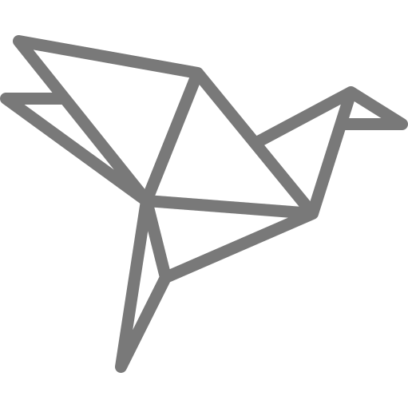

<!-- PROJECT LOGO -->
<br />
<p align="center">
  <a href="https://github.com/zalbani-lab/Origami">
    
  </a>

  <h3 align="center">Origami</h3>

  <p align="center">
    An inventory of ready-to-use components (HTML / SASS).
    <br />
    <a href="https://github.com/zalbani-lab/Origami"><strong>Online example »</strong></a>
    <br />
    <br />
    <a href="https://github.com/zalbani-lab/Origami">View Documentation</a>
    ·
    <a href="https://github.com/zalbani-lab/Origami">Report Bug</a>
    ·
    <a href="https://github.com/zalbani-lab/Origami">Request Feature</a>
  </p>
  <hr/>
</p>
<div align="center">

[![Forks][forks-shield]][forks-url]
[![Stargazers][stars-shield]][stars-url]
[![Issues][issues-shield]][issues-url]

</div>

## 🧐 About The Project <a name = "about"></a>

The aim of this project is to save you from reinventing the wheel. You gonna find in this project all basic component you need for building your website. Each component has been designed to respect SEO and accessibility rules moreover, they are versatile and easily customizable (and are pretty by the way)

### ⛏️ Built With

- [SASS](https://sass-lang.com/) - CSS with superpowers. Sass is the most mature, stable, and powerful professional grade CSS extension language in the world.

## 🏁 Getting Started <a name = "getting_started"></a>

Follow these steps to get a local copy up and running.

### 🔧 Prerequisites

To proceed with the installation you must have previously installed :

- [node.js](https://nodejs.org/en/download/) - Node.js® is a JavaScript runtime built on Chrome's V8 JavaScript engine.

### 🚀 Installation

1. Install dependencies

```sh
$ npm install
```

2. Run server

server with hot reload at [localhost:3000](http://localhost:3000)

```sh
$ npm start
```

3. Build (optional)

Generate static website. Will create a `/public` folder

```sh
$ npm build
```

### 🎈 File structure

```sh
.
├─ assets
├─ sass
│   ├─ components
│   ├─ layout
│   ├─ pages
│   ├─ reset
│   ├─ utilities
│   └─ main.scss
└─ index.html
```

## 🚧 Roadmap <a name = "roadmap"></a>

- [x] Add basic mixins, functions and variable
- [x] Theme
- [ ] Create basic components (button, nav, cards ...)
- [ ] Create advanced components (forms, sliders, animations ...)
- [ ] Create documentation website
- [ ] Create npm package ??

more to come ...

## 📝 License <a name = "license"></a>

Distributed under the MIT License. See `LICENSE` for more information.

## ✍️ Authors <a name = "authors"></a>

Alban Pierson – [https://github.com/Zalbani/](https://github.com/Zalbani)

<!--
## 🎉 Acknowledgements <a name = "acknowledgement"></a>

- Hat tip to anyone whose code was used
- Inspiration
- References
-->

<!-- MARKDOWN LINKS & IMAGES -->
<!-- https://www.markdownguide.org/basic-syntax/#reference-style-links -->

[forks-shield]: https://img.shields.io/github/forks/zalbani-lab/Origami?style=for-the-badge
[forks-url]: https://github.com/zalbani-lab/Origami/network/members
[stars-shield]: https://img.shields.io/github/stars/zalbani-lab/Origami?style=for-the-badge
[stars-url]: https://github.com/zalbani-lab/Origami/stargazers
[issues-shield]: https://img.shields.io/github/issues/zalbani-lab/Origami?style=for-the-badge
[issues-url]: https://github.com/zalbani-lab/Origami/issues
